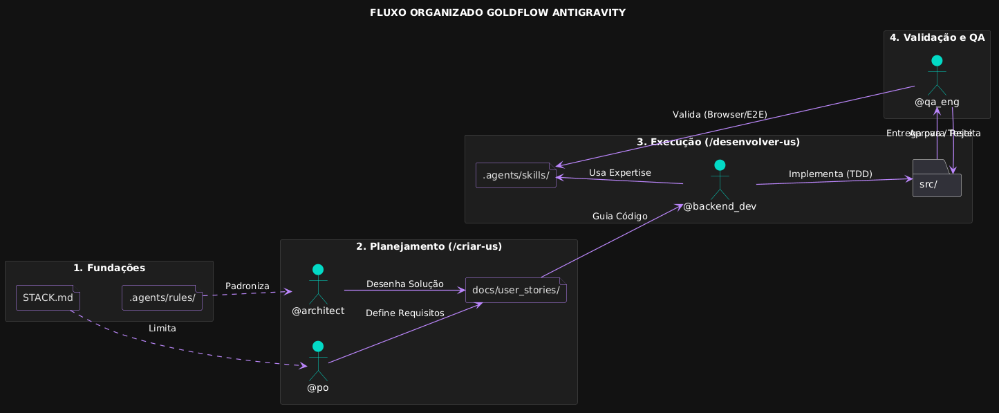

# 🚀 GoldFlow Antigravity: Squad de Desenvolvimento Autônomo

O **GoldFlow** é um framework de engenharia de software orientado a agentes de IA, projetado para garantir que a automação siga rigorosos padrões de qualidade, independente da tecnologia escolhida. Através de uma governança baseada em arquivos e contratos, ele transforma a interação com IA em um processo industrial de software.

## 🏗️ Ciclo de Vida do Projeto (The Golden Flow)

A governança técnica é centralizada no \STACK.md\, tornando o template dinâmico e "Plug-and-Play". O fluxo segue quatro etapas fundamentais:

1.  **Governança (\STACK.md\ & Rules):** Você dita as regras. Define linguagens, frameworks, padrões arquiteturais e metas de cobertura. O squad consome essas definições antes de qualquer ação.
2.  **Planejamento Colaborativo (\/criar-us\):** * O **@po** desenha os requisitos de negócio (INVEST).
    * O **@architect** projeta a solução técnica (Camadas, SOLID, Design Patterns).
    * O resultado é uma **User Story validada** salva em \docs/user_stories/\.
3.  **Desenvolvimento Orientado a Testes (\/desenvolver-us\):**
    * O **@backend_dev** implementa a lógica seguindo a planta do arquiteto.
    * A execução é pautada por **TDD** e respeita as metas de cobertura do Stack.
4.  **Validação e Qualidade (QA Loop):**
    * O **@qa_eng** utiliza a skill de Browser Validation para garantir que a interface e os critérios de aceite estão 100% funcionais.
    * A entrega final só é consolidada após o "carimbo" de aprovação do QA.

## 🧠 O Squad de Especialistas

* **@po (Product Owner):** Foca no "O quê". Responsável pela clareza funcional e valor de negócio.
* **@architect:** Foca no "Como". O guardião técnico que traduz requisitos em estruturas sustentáveis e escaláveis.
* **@backend_dev / @frontend_dev:** A força de execução. Codificam com foco em padrões Pro e alta testabilidade.
* **@qa_eng:** O filtro de qualidade. Realiza testes E2E reais via navegador e valida contratos técnicos.
* **@sec:** O auditor silencioso. Garante que nenhuma credencial ou vulnerabilidade seja commitada.
* **@devops:** O mestre de cerimônias do terminal e do ambiente local.

## 🛡️ Segurança: Blindagem e Proteção

Este framework implementa o conceito de **Blindagem Dupla**:
-   **MCP Firewall:** O arquivo \.mcpignore\ garante que a IA nunca tenha acesso a segredos locais (\.env\, \.key\, etc).
-   **Browser Allowlist:** Proteção contra *Indirect Prompt Injection*. Configure seu arquivo \~/.gemini/antigravity/browserAllowlist.txt\ para permitir apenas:
    -   \http://localhost:*\
    -   \http://127.0.0.1:*\

## 🔌 Expansão via MCP (Superpoderes)

O GoldFlow é 100% compatível com o Model Context Protocol. Recomendamos o uso de:
-   **SonarQube MCP:** Para análise de débito técnico em tempo real.
-   **GitHub MCP:** Para que o squad possa gerenciar Pull Requests e Issues de forma autônoma.

---
*Gerado por GoldFlow Antigravity - Elevando a Engenharia de IA ao próximo nível.*
